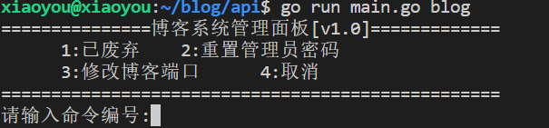

# 后端源码

配置文件在 `api\configs\app.ini` 里。自己看情况修改

如果想本地启动需要先 `export XBLOG_RUNMODE=1` 才能正常启动，要不然会报错

## 自带的控制台

启动应用时添加 blog 参数即可



## 文章导出功能

输入下面的命令即可导出文章为markdown文件

```bash
go run main.go export
```

## 项目编译运行

目前系统只支持linux，请在linux上操作

如果想使用二进制文件运行项目需要把 `assets` ,`configs`, `plugins` 这三个文件和二进制文件保持在同一个路径

```bash
# 安装依赖并编译
go mod tidy
go build main.go

# 如果之前有启动过服务需要先停止并卸载服务才能正常使用
# 停止服务
sudo ./main stop
# 卸载服务
sudo ./main uninstall

# 安装服务
sudo ./main install
# 启动服务(启动服务后会自动在后台运行)
sudo ./main start

# 查看服务的状态
systemctl status xblog
```
